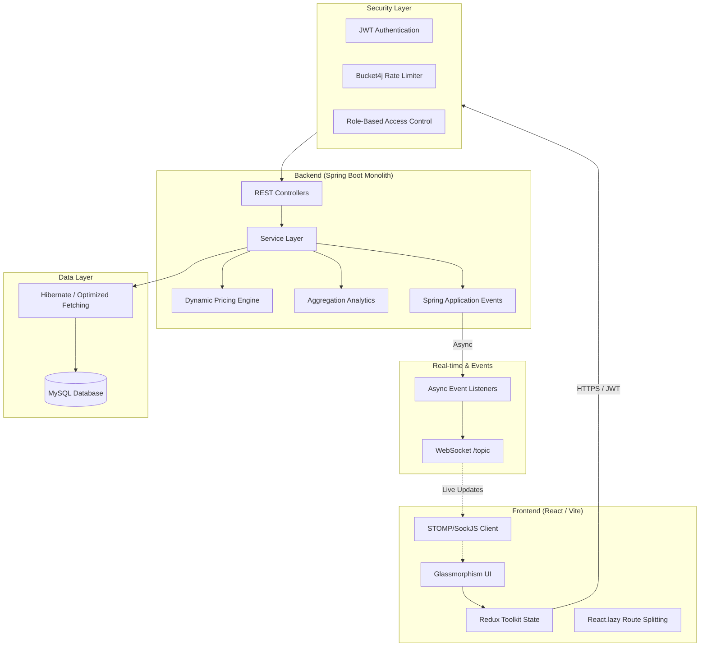

# Technical Architecture

## System Overview
The SmartPark Platform is built on a modern, decoupled architecture designed for high availability, real-time interactivity, and enterprise-grade security.

## Architectural Highlights

### 1. Hybrid Monolithic Design
We preserve the simplicity of a monolith for deployment efficiency while implementing **Event-Driven Architecture** internally. This allows asynchronous processing of non-blocking tasks like notifications and auditing.

### 2. Real-Time Interactivity
Integrated **WebSockets (STOMP)** provide instant synchronization between the facility occupancy state and the user's view, eliminating manual refreshes.

### 3. Enterprise Security
Multiple layers of defense:
- **Rate Limiting**: Protects against DDoS and brute force.
- **JWT Rotation**: Secure, stateless authentication with refresh tokens.
- **SQLi Prevention**: Leveraging Spring Data JPA and parameterized queries.

### 4. Performance Optimized
- **Backend**: Resolved N+1 problems via optimized `JOIN FETCH` queries.
- **Frontend**: Reduced bundle size via route-based code splitting.
