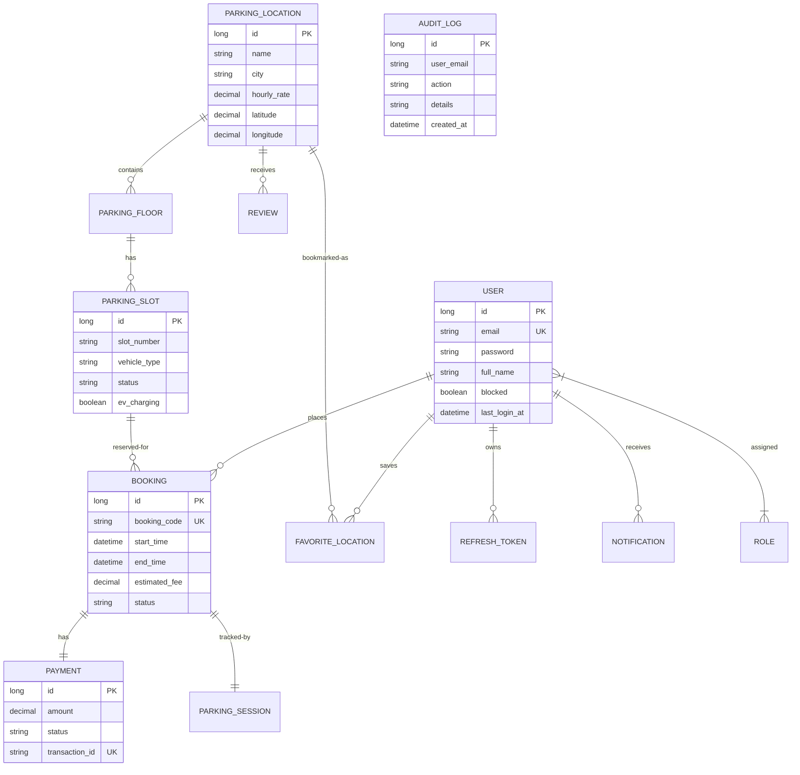

# Data Architecture

## Entity Relationship Diagram
The schema is designed for transactional integrity and analytical performance.

## Key Constraints & Optimization
- **Unique Indexes**: Implemented on `user(email)`, `booking(booking_code)`, and `payment(transaction_id)` to ensure data consistency.
- **Foreign Key Constraints**: Cascading deletes are strictly controlled (e.g., `PARKING_FLOOR` -> `PARKING_SLOT`) to maintain referential integrity.
- **Data Types**: Correct use of `DECIMAL(19,2)` for financial fields to avoid rounding errors.
