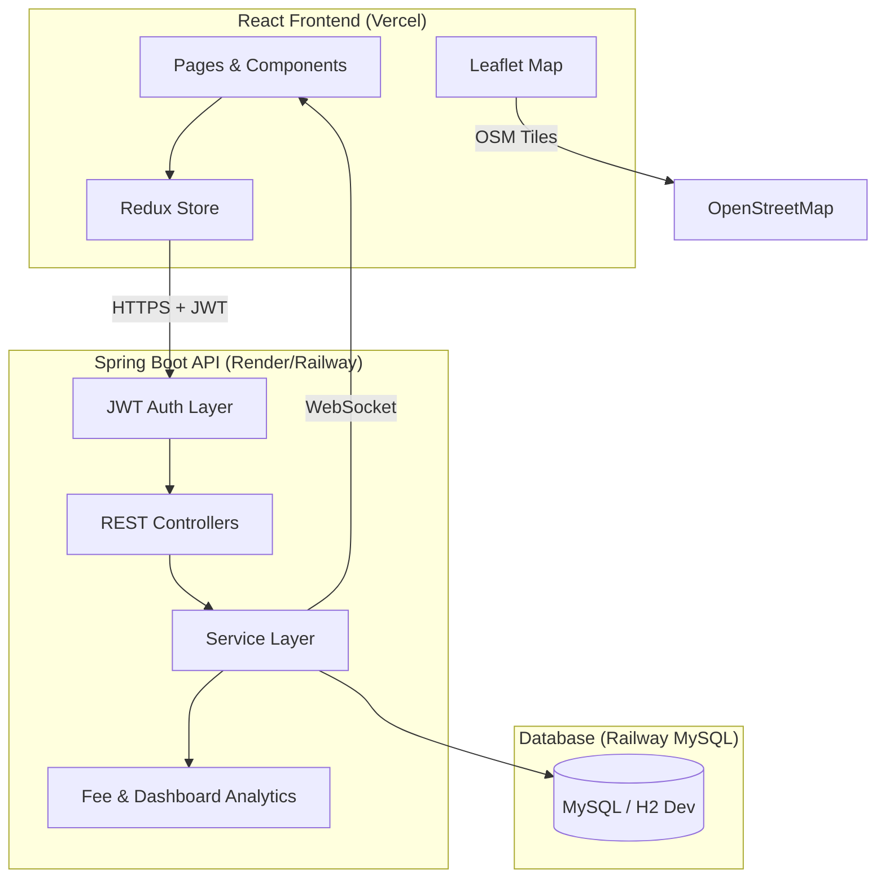

# SmartPark — Enterprise Smart Parking Management Platform

A production-ready, full-stack Smart Parking SaaS platform transformed from the basic [Car-Parking-Management-System](https://github.com/Priyanshu-Patidar/Car-Parking-Management-System) into an enterprise-grade solution with JWT security, real-time availability, map-based search, smart booking, QR entry, analytics, and admin management.


## Features

### User Features
- Secure registration & JWT authentication with refresh tokens
- Search parking by city, address, or GPS location
- Interactive OpenStreetMap + Leaflet map with live markers
- Real-time slot availability (WebSocket)
- Smart pre-booking with fee estimation & QR code entry
- Booking history, receipts, favorites
- Reviews & ratings
- Dark/light mode responsive UI

### Admin Features
- Parking location / floor / slot management
- User management (block/unblock/delete)
- Booking oversight & audit logs
- Revenue & occupancy analytics dashboard
- Peak-hour demand analytics (AI-inspired dynamic pricing)

### Security
- BCrypt password hashing
- Role-Based Access Control (ADMIN, USER)
- JWT + refresh token rotation
- API rate limiting (Bucket4j)
- CORS, input validation, global exception handling
- SQL injection prevention via JPA

## Tech Stack

| Layer | Technologies |
|-------|-------------|
| Backend | Java 17, Spring Boot 3, Spring Security, JPA, MySQL/H2, JWT, Swagger, WebSocket |
| Frontend | React 18, Vite, Tailwind CSS, Redux Toolkit, Leaflet, Recharts, Framer Motion |
| Maps | OpenStreetMap + Leaflet.js (free) |
| DevOps | Docker, Docker Compose, GitHub Actions |

## Architecture



## Project Structure

```
smart-parking-platform/
├── backend/                 # Spring Boot API
│   └── src/main/java/com/smartparking/
│       ├── controller/
│       ├── service/
│       ├── repository/
│       ├── entity/
│       ├── dto/
│       ├── config/
│       ├── security/
│       ├── exception/
│       ├── util/
│       ├── mapper/
│       └── analytics/
├── frontend/                # React SPA
│   └── src/
│       ├── pages/
│       ├── components/
│       ├── store/
│       └── api/
├── docker-compose.yml
├── .github/workflows/ci.yml
└── README.md
```

## API Endpoints

| Method | Endpoint | Description |
|--------|----------|-------------|
| POST | `/api/auth/register` | Register user |
| POST | `/api/auth/login` | Login |
| POST | `/api/auth/refresh-token` | Refresh JWT |
| GET | `/api/parking/search?location=` | Search by location |
| GET | `/api/parking/nearby?lat=&lng=` | Nearby parking |
| GET | `/api/parking/{id}` | Parking details |
| POST | `/api/parking/prebook` | Pre-book slot |
| PUT | `/api/parking/cancel/{id}` | Cancel booking |
| GET | `/api/bookings/user` | User bookings |
| GET | `/api/bookings/admin` | All bookings (admin) |
| POST | `/api/admin/parking` | Create parking (admin) |
| GET | `/api/dashboard/stats` | Analytics |

**Swagger UI:** `http://localhost:8080/api/swagger-ui.html`

## Quick Start (Local)

### Prerequisites
- Java 17+
- Maven 3.8+
- Node.js 18+

### 1. Clone & setup
```powershell
cd C:\Users\priya\Projects\smart-parking-platform
.\scripts\setup.ps1
```

### 2. Start backend
```powershell
cd backend
mvn spring-boot:run
```

### 3. Start frontend
```powershell
cd frontend
npm run dev
```

Open **http://localhost:5173**

### Demo Credentials
| Role | Email | Password |
|------|-------|----------|
| Admin | admin@smartparking.com | Admin@123 |
| User | user@smartparking.com | User@123 |

## Docker

```bash
docker-compose up --build
```

- Frontend: http://localhost:5173
- Backend: http://localhost:8080/api
- MySQL: localhost:3306

## Deployment (Free Tier)

### Frontend → Vercel
1. Import `frontend/` folder to Vercel
2. Set env: `VITE_API_BASE_URL=https://your-api.onrender.com/api`
3. Deploy

### Backend → Render
1. Create Web Service from `backend/`
2. Build: `mvn -DskipTests package`
3. Start: `java -jar target/smart-parking-platform-1.0.0.jar`
4. Env vars: `SPRING_PROFILES_ACTIVE=prod`, `DATABASE_URL`, `JWT_SECRET`, `CORS_ORIGINS`

### Database → Railway MySQL
1. Create MySQL instance on Railway
2. Copy connection URL to `DATABASE_URL`

## Screenshots

> Add screenshots after running the app:
> - Home page
> - Map view
> - Booking confirmation with QR
> - Admin dashboard

## Testing

```bash
cd backend && mvn test
```

## Future Enhancements

- [ ] Mobile app (React Native)
- [ ] Payment gateway (Razorpay/Stripe)
- [ ] License plate OCR entry
- [ ] ML-based occupancy prediction
- [ ] Multi-tenant operator support

## License

MIT License — free for portfolio and commercial use.

---

Built as a resume-worthy enterprise full-stack project transforming a basic parking CRUD app into a commercial-grade Smart Parking SaaS platform.
