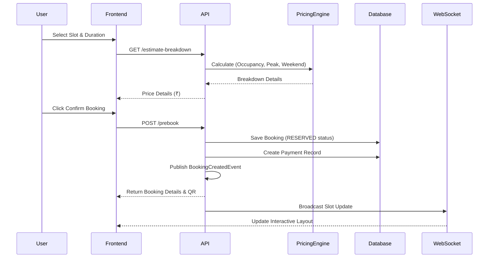
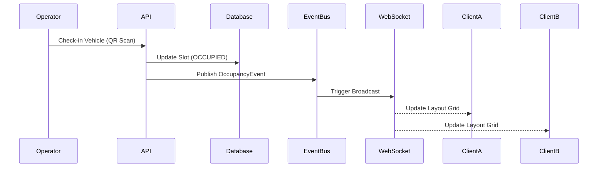
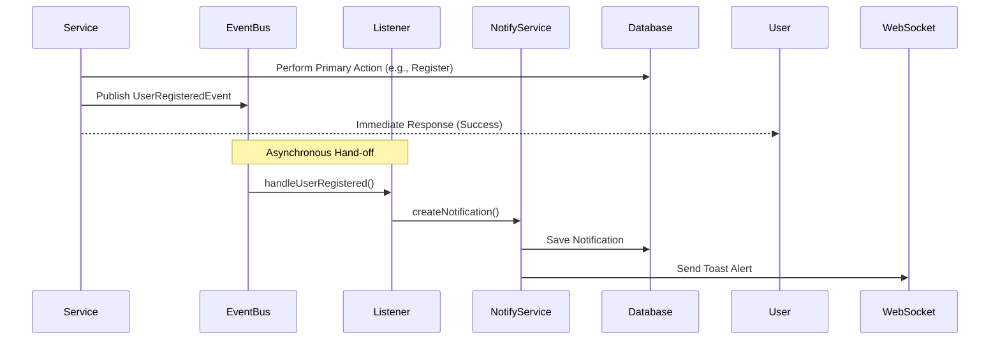
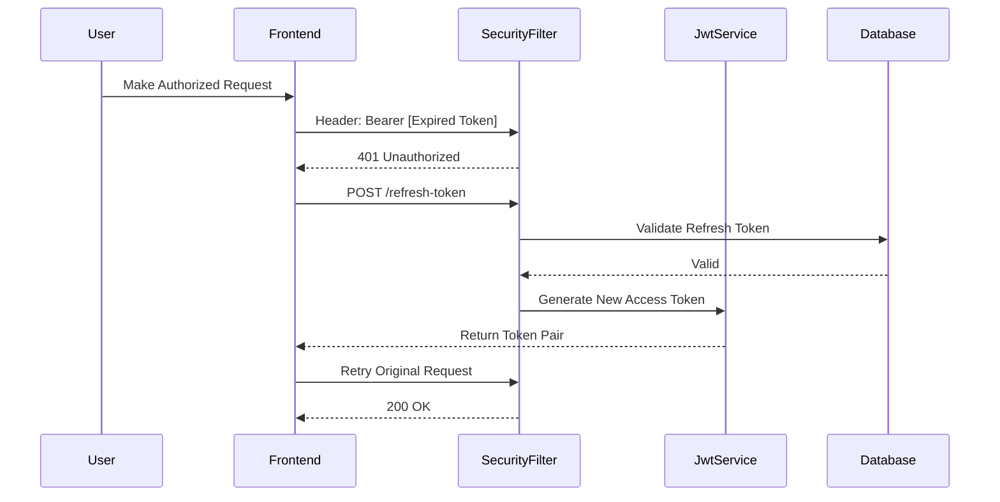

# Core Sequence Flows

## 1. Smart Booking Flow
How the system handles price discovery, booking, and real-time synchronization.

## 2. Real-Time Occupancy Flow
How multi-floor layout stays synchronized across multiple clients.

## 3. Asynchronous Notification Flow
How internal system events trigger user communications without blocking.

## 4. Security & JWT Rotation
How the system maintains stateless security with automatic refresh.

